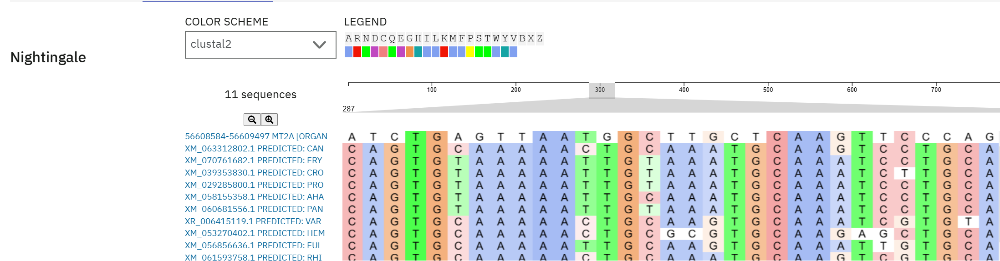

## 1. Человеческий ген MT2A: https://www.ncbi.nlm.nih.gov/gene/4502

Ген MT2A (metallothionein 2A) кодирует белок, относящийся к семейству металлотионинов — низкомолекулярных, богатых цистеином белков, участвующих в регуляции и детоксикации металлов в организме. Функции: связывает ионы металлов, таких как цинк, медь, кадмий и ртуть. Защищает клетки от токсичности тяжёлых металлов и окислительного стресса, регулирует уровень ионов металлов, участвующих в активности ферментов и транскрипционных факторов.

## 2. Поиск в BLAST (https://blast.ncbi.nlm.nih.gov/Blast.cgi) со следующими параметрами:

Database - Standard databases (nr etc.)

Optimize for - Highly similar sequences (megablast)

Exclude - mammals (taxid:40674)

## 3. Гомологичные гены:

| Number | Name                            | Russian name                 | Description                                                                                | Per. Ident |
|--------|---------------------------------|------------------------------|--------------------------------------------------------------------------------------------|------------|
| 1      | Euleptes europaea            | Европейский листопалый геккон            | PREDICTED: Euleptes europaea metallothionein-1-like (LOC130483748), mRNA         | 87.36%    |
| 2      | Candoia aspera           | Тихоокеанский удав         | PREDICTED: Candoia aspera metallothionein-1 (LOC134503871), mRNA   | 87.36%     |
| 3      | Crotalus tigris             | Тигровый гремучник                       | PREDICTED: Crotalus tigris metallothionein-1-like (LOC120312713), mRNA                         | 91.80%     |
| 4      | Hemicordylus capensis            | Гемикордилус капенсис              | PREDICTED: Hemicordylus capensis metallothionein-1 (LOC128334120), mRNA               | 93.55%     |
| 5      | Erythrolamprus reginae                | Королевская наземная змея         | PREDICTED: Erythrolamprus reginae metallothionein-1-like (LOC139172532), mRNA    | 93.44%	    |
| 6      | Varanus komodoensis                   | Комодский варан | PREDICTED: Varanus komodoensis uncharacterized LOC123025416 (LOC123025416), ncRNA | 85.39%	    |
| 7      | Ahaetulla prasina | Травянисто-зелёная плетевидка       | PREDICTED: Ahaetulla prasina metallothionein-1 (LOC131184255), mRNA | 91.80%	    |
| 8      | Protobothrops mucrosquamatus              | Коричнево-пятнистая ямная гадюка                       | PREDICTED: Protobothrops mucrosquamatus metallothionein-1-like (LOC114923179), mRNA              | 91.80%	    |
| 9      | Pantherophis guttatus                | Маисовый полоз            | PREDICTED: Pantherophis guttatus metallothionein-1 (LOC132709003), mRNA                | 91.80%	    |
| 10     | Rhineura floridana              | Флоридская червеобразная ящерица             | PREDICTED: Rhineura floridana metallothionein-1 (LOC133368994), mRNA              | 84.27%	    |

## 4. Множественное выравнивание

Результаты выравнивания в файле [alignment.aln](alignment.aln)

## 5. Краткий анализ консервативности полученного выравнивания

На основе [alignment.aln](alignment.aln)

Для анализа выравнивания с точки зрения консервативных участков определила области, где последовательности разных транскриптов/изоформ совпадают друг с другом и с геномной последовательностью (NC_000016.10), что может свидетельствовать о функциональной важности этих участков.

Консервативные участки (по совпадениям в множестве последовательностей):
Регион с "TCCGAAGACTGCTCGTGCT" встречается у большого числа изоформ (в центре выравнивания, третья-четвёртая панели). Похожая последовательность присутствует у: XM_0606815, XM_0581553, XM_0707616, XM_0292858, XM_0393538. Часто заканчивается на: GGTGG.GTGTGC — эта последовательность сильно консервативна.
Регион "TCCTGCGGCAACAACTGTCAGTGTAAAAATT...": присутствует почти без изменений у большинства транскриптов. Это может быть экзон с важной кодирующей функцией.
Конец выравнивания: "CCAGGGCTGTATTTGCAAAGGCCCCCCTGCC...": присутствует практически без различий у всех изоформ — очень высокая степень консервации.

Менее консервативные участки: начальные участки выравнивания (первые 1–2 панели), много пропусков и различий между транскриптами — скорее всего, это UTR или интронные регионы, подверженные сплайсинг-вариациям.

Основные консервативные участки: регионы с участками TCCGAAGACTGCTCGTGCT...GGTGG...GTGC (возможно, кодирующие домены); TCCTGCGGCAACAACTGTCAGTGTAAAAATT... — вероятный кодирующий экзон; завершающая область с мотивом CCAGGGCTG...GCAAGT.

На основе [identity_matrix.pim](identity_matrix.pim)

Высокая степень идентичности внутри группы (2–7): все последовательности XM_* имеют между собой очень высокую степень сходства — от 70% до почти 100%.

Наибольшее сходство наблюдается между:

4 и 5: 96.98%

5 и 7: 90.24%

6 и 7: 91.38%

Выделение кластера мРНК (2–7): можно выделить группу консервативных мРНК, объединяющую строки 2–7. Они имеют сходство >70% между собой. Внутри этой группы, особенно между 3–7, сходство >85%, что говорит о значительном перекрытии консервативных доменов.

Менее консервативные последовательности (8–11): последовательности 8–11 имеют умеренное сходство с группой 2–7 (в диапазоне 59–71%), что указывает на частичную гомологию. Однако между собой (8–11) они тоже показывают заметное сходство.

Итак, консервативные участки точно присутствуют между последовательностями 2–7. Их высокая степень идентичности свидетельствует о сохранении кодирующих или структурных доменов. Группа 8–11 также содержит частично консервативные участки, но они менее схожи с основным кластером.

## 6. Объединяющий таксон: 

Все виды относятся к классу Reptilia (Пресмыкающиеся). Все (включая Rhineura floridana) входят в отряд Squamata (Чешуйчатые) — это объединение змей, ящериц и амфисбен.

Объединяющий таксон: Squamata (Чешуйчатые)

Чешуйчатые (Squamata) — крупнейший отряд класса пресмыкающихся, включающий более 11 тысяч видов, таких как змеи, ящерицы, хамелеоны, вараны и амфисбены. Характерны подвижные челюсти, тело, покрытое чешуей, способность к линьке. Представители отряда широко распространены от пустынь до тропических лесов.
